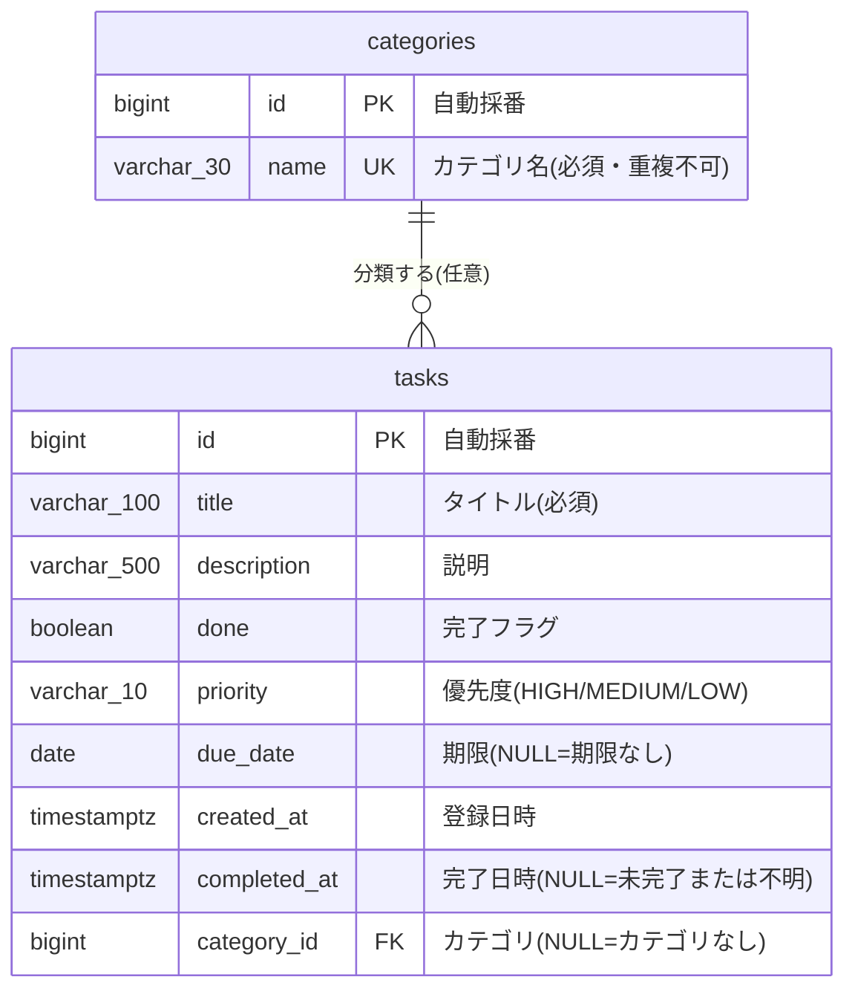

# 基本設計書 — タスク管理アプリ

| 項目 | 内容 |
|---|---|
| 文書の位置づけ | 要件を「どういう画面・API・データ構造で実現するか」に落とし込む(外部設計) |
| 上位文書 | [02_要件定義.md](./02_要件定義.md) |

## 1. システム構成

構成図は [../../images/architecture.png](../../images/architecture.png)(詳細版: [../../architecture.drawio](../../architecture.drawio))を参照。
SPA(React)+ REST API(Spring Boot)+ RDB(PostgreSQL)の3層構成。

## 2. 画面設計

### 画面一覧

| 画面ID | 画面名 | パス | 概要 | 対応機能 |
|---|---|---|---|---|
| S-01 | タスク一覧画面 | / | 一覧表示・登録・完了切替・削除・優先度の設定と並べ替え・期限の設定・完了日時の表示・カテゴリの設定と絞り込み・カテゴリの追加と削除を1画面で行う | F-1〜F-8 |

### S-01 画面項目・アクション

| 項目/操作 | 内容 | 呼び出すAPI |
|---|---|---|
| ヘッダー | タイトルと残件数(未完了の数)を表示 | — |
| 登録フォーム | タイトル(必須)・説明(任意)・優先度(高/中/低から選択、初期値は中)・期限(任意、日付入力)・カテゴリ(任意、「カテゴリなし」〈初期値〉+各カテゴリから選択)・追加ボタン。タイトル空の間はボタン非活性 | A-03, A-06 |
| 絞り込み | 「すべて」(初期値)/各カテゴリを選択。切り替えると一覧を再取得する | A-01 |
| 並び順 | 「登録順」(初期値)/「優先度順」を選択。切り替えると一覧を再取得する。絞り込みと併用できる | A-01 |
| タスク一覧 | 選択中の絞り込み・並び順で表示。各タスクに優先度(高/中/低)とカテゴリ(設定時のみ)、期限(設定時のみ)、完了日時(完了済みかつ記録ありのみ、`yyyy/MM/dd HH:mm`)を表示する。完了タスクは取り消し線+背景色で区別。期限切れタスクは赤枠+「期限切れ」ラベルで強調 | A-01 |
| チェックボックス | 完了⇔未完了を切り替える(優先度・期限・カテゴリは保持)。完了にすると完了日時が記録され、取り消すと消える | A-04 |
| 削除ボタン | タスクを削除する | A-05 |
| カテゴリ管理 | 一覧の下に配置。カテゴリ名(必須・30文字まで)と追加ボタン、登録済みカテゴリと各削除ボタンを表示する。重複などのエラーは入力欄の下に表示し、入力内容は残す | A-06, A-07 |
| カテゴリ削除ボタン | 「このカテゴリのタスクはカテゴリなしになります」と確認し、了承したら削除する。一覧を再取得し、絞り込み中のカテゴリを削除した場合は「すべて」に戻す | A-08, A-01 |
| エラー表示 | API失敗時、画面上部にメッセージを表示 | — |

## 3. API設計

### API一覧

| API ID | メソッド | パス | 概要 | 正常時 | 対応機能 |
|---|---|---|---|---|---|
| A-01 | GET | /api/tasks | タスク一覧取得。`sort` で並び順を指定(`ID`=登録順〈既定〉、`PRIORITY`=優先度順〈高→中→低、同じ優先度はID昇順〉)。`categoryId` を指定するとそのカテゴリのタスクに絞り込む(省略時はすべて。存在しないIDは空の一覧)。各タスクに期限切れ判定結果・完了日時・カテゴリを含む | 200 | F-1, F-5, F-6, F-7, F-8 |
| A-02 | GET | /api/tasks/{id} | タスク1件取得 | 200 | — |
| A-03 | POST | /api/tasks | タスク登録(優先度・期限・カテゴリを含む。優先度未指定は中、期限未指定は期限なし、カテゴリ未指定はカテゴリなし) | 201 | F-2, F-5, F-6, F-8 |
| A-04 | PUT | /api/tasks/{id} | タスク更新(完了切替・優先度変更・期限変更・カテゴリ変更を含む。優先度未指定は中、期限 null は期限解除、カテゴリ null はカテゴリ解除。完了状態が変わったときに完了日時を記録・クリア) | 200 | F-3, F-5, F-6, F-7, F-8 |
| A-05 | DELETE | /api/tasks/{id} | タスク削除 | 204 | F-4 |
| A-06 | GET | /api/categories | カテゴリ一覧取得(登録順〈ID昇順〉) | 200 | F-8 |
| A-07 | POST | /api/categories | カテゴリ追加(名前の前後の空白は除いて登録) | 201 | F-8 |
| A-08 | DELETE | /api/categories/{id} | カテゴリ削除。使用中でも削除でき、そのカテゴリのタスクはカテゴリなしに戻る | 204 | F-8 |

### 入出力(共通)

- リクエスト(A-03/A-04): `{ "title": string, "description": string|null, "done": boolean, "priority": "HIGH"|"MEDIUM"|"LOW"|null, "dueDate": "yyyy-MM-dd"|null, "categoryId": number|null }`(`priority` 省略・null は `MEDIUM`。`dueDate` 省略・null は期限なし。`categoryId` 省略・null はカテゴリなし。PUTは全項目置き換えのため、省略すると期限・カテゴリは解除される)
- レスポンス: `{ "id": number, "title": string, "description": string|null, "done": boolean, "priority": "HIGH"|"MEDIUM"|"LOW", "dueDate": "yyyy-MM-dd"|null, "overdue": boolean, "category": { "id": number, "name": string }|null, "createdAt": string, "completedAt": string|null }`(`completedAt` はサーバーが記録する完了日時。リクエストでは受け取らない)
- カテゴリのリクエスト(A-07): `{ "name": string }` / レスポンス(A-06/A-07): `{ "id": number, "name": string }`
- エラー: `{ "message": string }` に統一。バリデーション違反・不正な `priority`/`sort`/`dueDate`/`categoryId` の値・存在しない `categoryId` の指定(A-03/A-04)=400、対象なし=404、カテゴリ名の重複(A-07)=409

各項目の型・必須・文字数などの詳細は Swagger UI(/api/docs)を正とする。

## 4. データ設計

### ER図

カラムの詳細定義は [04_詳細設計.md](./04_詳細設計.md) のテーブル定義書を参照。

## 5. 処理方式

- 完了切替・削除は楽観的な単純更新とし、同時編集の排他制御は行わない(同時利用10名規模のため。要件2.性能)
- 一覧はページングなしの全件取得とする(タスク件数は数百件規模を想定)
- 優先度順の並べ替えはAPI側で行う(ID昇順で取得した一覧を高→中→低で安定ソート)。件数が数百件規模のためメモリ上のソートで十分とする
- 期限は日付のみ持つ(時刻は持たない)。要件の「今日より前」が日付単位の定義であり、タイムゾーン変換が不要になるため
- 期限切れ判定(期限が今日より前かつ未完了)はAPI側(Service)で行い、レスポンスの `overdue` で返す。業務ルールを1か所に集約し、将来の絞り込み・並べ替えでも再利用するため。「今日」はサーバーのタイムゾーン(TZ=Asia/Tokyo)を基準とし、取得時点で判定する(画面を開いたまま日付をまたいだ場合は再取得で更新される)
- 完了日時はサーバー側(Service)で `Clock` から取得した現在時刻をセットし、クライアントからは受け取らない。未完了→完了で記録、完了→未完了でクリアし、完了状態が変わらない更新では維持する(再完了時は新しい時刻で上書き)
- カテゴリは独立したテーブル(categories)で持ち、タスクは任意で1つ参照する(外部キー、NULL=カテゴリなし)。カテゴリを利用者が追加・削除できる要件のため、優先度のような固定の値(enum)にはしない
- カテゴリでの絞り込みはAPI側で行う(`categoryId` クエリ)。並び順と同じくAPIで一覧を作る方式にそろえる
- 使用中のカテゴリの削除は、エラーにせずタスクを「カテゴリなし」に戻す方式とする。比較した「使用中は削除禁止(409)」は、一括で付け替える画面がないため利用者がタスクを1件ずつ編集する必要があり、任意項目であるカテゴリのために削除を止める理由が薄いため採らない。タスク本体は失われず、失うのはカテゴリの紐付けだけのため、画面で削除前に確認を出して補う。DBの外部キーを `ON DELETE SET NULL` とし、DB側でも保証する
- カテゴリ名は重複を禁止する(一意制約)。同じ名前が並ぶと絞り込みで区別できないため。上限30文字は短いラベルとして一覧・セレクトに表示するための目安で、広げる変更(新しいVファイル)は既存データに影響しないため、狭めに始める
- 完了状態は既存の `done` を正とし、`completed_at` を追加で持つ(`completed_at` の NULL 判定への一本化は採らない)。一本化すると、完了日時が不明な既存の完了済みタスクを未完了に戻すか架空の日時を入れる必要があり、`done` 列の削除も元に戻せないため。2列の不整合はCHECK制約(完了日時があれば完了済み)とエンティティの更新処理の集約で防ぐ

## 6. 要件トレーサビリティ

| 要件 | 画面 | API |
|---|---|---|
| F-1 一覧表示 | S-01 | A-01 |
| F-2 登録 | S-01 | A-03 |
| F-3 完了切替 | S-01 | A-04 |
| F-4 削除 | S-01 | A-05 |
| F-5 優先度 | S-01 | A-01(並べ替え)、A-03(設定)、A-04(完了切替時に保持) |
| F-6 期限 | S-01 | A-01(表示・期限切れ判定)、A-03(設定)、A-04(変更・解除、完了切替時に保持) |
| F-7 完了日時 | S-01 | A-01(表示)、A-04(完了時に記録・取り消し時にクリア) |
| F-8 カテゴリ | S-01 | A-01(表示・絞り込み)、A-03(設定)、A-04(変更・解除、完了切替時に保持)、A-06(一覧)、A-07(追加)、A-08(削除・使用中のタスクはカテゴリなしに戻す) |
